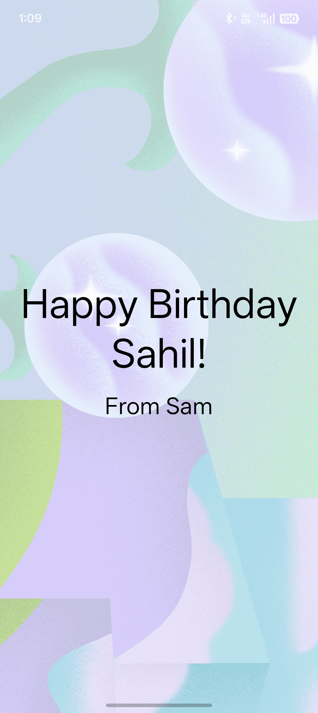

# Android Basics with Compose

A hands-on Android development journey with **Kotlin** and **Jetpack Compose**, following Google's **Android Basics with Compose** course.

The goal is simple:

> **Learn → Build → Get Stuck → Understand → Fix → Document → Push**

This repository documents the projects, concepts, and progress I build along the way.

---

## 🛠️ Tech Stack

- **Kotlin**
- **Jetpack Compose**
- **Material 3**
- **Android Studio**

---

## 📚 Learning Path

This repository follows Google's official **Android Basics with Compose** course as the main learning spine.

### Unit 1 — Your First Android App

- [x] Introduction to Kotlin
- [x] Set up Android Studio
- [x] Build a basic layout
- [x] Birthday Card
- [x] Business Card

### Unit 2 — Building App UI

- [x] Kotlin fundamentals *(in progress)*
- [ ] Add a button to an app
- [ ] Interacting with UI and state

### Unit 3 — Display Lists and Use Material Design

- [ ] More Kotlin fundamentals
- [ ] Build a scrollable list
- [ ] Build beautiful apps

### Unit 4 — Navigation and App Architecture

- [ ] Architecture Components
- [ ] Navigation in Jetpack Compose
- [ ] Adapt for different screen sizes

### Unit 5 — Connect to the Internet

- [ ] Get data from the internet
- [ ] Load and display images

### Unit 6 — Data Persistence

- [ ] Introduction to SQL
- [ ] Use Room for data persistence
- [ ] DataStore

### Unit 7 — WorkManager

- [ ] Background work and WorkManager

### Unit 8 — Views and Compose

- [ ] Views and Compose interoperability

---

# 🚀 Projects

## 🎂 Birthday Card

My first Jetpack Compose UI project.

This project introduced me to building a simple Android interface using Compose and helped me understand the relationship between composable functions, layout containers, modifiers, images, and text.

### Concepts Practiced

- `@Composable`
- `Text`
- `Image`
- `Box`
- `Column`
- `Modifier`
- `padding`
- `Alignment`
- `Arrangement`
- Compose Preview
- Image and text layout
- Basic UI composition

---

## 💼 Business Card

A simple Business Card built by breaking the UI into smaller, reusable composables.

Instead of putting the entire interface into one function, the screen was divided into separate UI sections such as the profile and contact information.

### UI Structure

```text
BusinessCard
│
├── Profile
│   ├── Image
│   ├── Name
│   └── Title
│
└── ContactInfo
    ├── Phone
    ├── Social Handle
    └── Email
```

### Concepts Practiced

- Reusable composables
- `Column`
- `Row`
- `Image`
- `Text`
- Material Icons
- `Arrangement.spacedBy()`
- `horizontalAlignment`
- `Modifier.size()`
- Passing data through composable parameters
- Compose Preview
- Basic UI hierarchy

---
---

## 🧩 Unit 2 — Kotlin Fundamentals

Currently working through the Kotlin Fundamentals pathway in Google's Android Basics with Compose course.

### Concepts Practiced

#### 1. Conditionals

- `if`
- `if–else`
- `if–else if–else`
- `when`

**What I learned:** How to control program flow using conditions and choose between different execution paths.

#### 2. Null Safety

- Nullability
- Nullable types using `?`
- Safe-call operator `?.`
- Elvis operator `?:`

**What I learned:** How Kotlin handles nullable values and provides ways to work safely with values that may be `null`.

### Practice Files

```text
kotlinfundamentals/
├── conditionals/
│   ├── If_Elseif_Else.kt
│   └── When.kt
└── nullsafety/
    └── Nullability.kt
    

```

## 📱 Unit 1 Screenshots

 <div align="center">

<table>
<tr>
<td align="center">

<b>🎂 Birthday Card</b><br><br>


</td>

<td>&nbsp;&nbsp;&nbsp;&nbsp;</td>

<td align="center">

<b>💼 Business Card</b><br><br>


</td>
</tr>
</table>

</div>

---

# 📸 Project Documentation

Screenshots and supporting documentation are stored inside the `docs` directory.

```text
docs/
└── screenshots/
    ├── birthday-card.jpg
    └── business-card.jpg
```

The screenshots document the visible result of each learning milestone and will continue to be updated as new projects are completed.

---

# 🧠 Learning Approach

This repository is not intended to be a collection of copied tutorial code.

The goal is to learn by actually building.

```text
Learn
  ↓
Build
  ↓
Get Stuck
  ↓
Understand
  ↓
Fix
  ↓
Document
  ↓
Push
  ↓
Move Forward
```

When something doesn't make sense, I try to understand the underlying concept instead of simply copying a solution.

The repository is therefore also a record of my progression from basic Compose UI toward building complete Android applications.

---

# 📈 Progress

Every completed project adds another practical piece to the Android development journey.

The focus is not on creating a large number of commits just to keep the contribution graph active.

The focus is on making **real progress through real code**.

Each meaningful milestone is documented with:

- The concept learned
- The code built
- The resulting UI
- The relevant screenshot
- A Git commit

---

# 🎯 What's Next?

## Unit 2 — Building App UI

Currently working through the **Kotlin Fundamentals** pathway.

Next steps:

- Continue the remaining Kotlin Fundamentals lessons.
- Practice the concepts independently.
- Learn to add buttons and handle user interactions.
- Explore state and recomposition in Jetpack Compose.

More projects and screenshots will be added as the journey continues.
---

# 📖 Course

This repository follows Google's official course:

**[Android Basics with Compose](https://developer.android.com/courses/android-basics-compose/course)**

---

## 🌱 Building in Public

This repository is a record of the journey — from learning the fundamentals of Kotlin and Jetpack Compose to eventually building larger, production-oriented Android applications.

**One concept. One project. One commit at a time.**
